# worldgen: wall-following test world generator + evaluation harness

Generates Gazebo `.world` files for the `wall_following_assigment` package so
the PID wall follower can be tested on arbitrary wall configurations (not just
the two stock worlds), **and** scores how well the follower drives them.

All geometry respects the assignment's conventions: the Husky spawns at
**(-3, 2) facing +x** (`gazebo.launch.py`) and follows the wall on its
**left**, so every generated course starts with a wall ~2 m to the robot's
left (same as `walls_one_sided.world`). Walls are the same static
0.2 m-thick, 2.8 m-tall grey boxes the stock worlds use.

Runtime is **stdlib-only**; `pytest` is a dev dependency. Run everything from
this directory with [uv](https://docs.astral.sh/uv/).

## Generating worlds

```bash
uv run worldgen list                        # presets + what each one tests
uv run worldgen generate zigzag             # write gen_zigzag.world + preview
uv run worldgen generate gaps --gap-width 3.0
uv run worldgen generate curve_left --clutter 4 --seed 7
uv run worldgen generate right_turn --two-sided --mirror
uv run worldgen random --seed 42 --segments 7 --arcs
uv run worldgen random --seed 5 --closed    # endless randomized loop
uv run worldgen preview ../wall_following_assigment/worlds/walls_two_sided.world
```

Worlds are written to `../wall_following_assigment/worlds/` by default
(`--out` to override), prefixed `gen_`. Add `--dry-run` to preview/validate
without writing. Each world is accompanied by a **`<name>.course.json`**
sidecar (see below) and embeds its generator parameters in an XML comment.

### Presets

| preset        | what it stresses                                          |
|---------------|-----------------------------------------------------------|
| `straight`    | convergence to the desired distance, steady-state error   |
| `left_turn`   | outside corner — wall falls away                          |
| `right_turn`  | inside corner — front-cone safety override                |
| `zigzag`      | oscillation / PID gain tuning (±60°)                      |
| `s_curve`     | smooth tracking through gentle 45° bends                  |
| `u_turn`      | back-to-back outside corners (180°)                       |
| `gauntlet`    | mixed inside + outside corners                            |
| `room`        | closed loop, four inside corners, runs forever            |
| `gaps`        | doorway gaps in the wall → **wall-loss / reacquire**      |
| `curve_left`  | constant-radius 135° left arc (wall inside the bend)      |
| `curve_right` | constant-radius 135° right arc (wall outside the bend)    |

### Flags (generate / random)

| flag | effect |
|------|--------|
| `--two-sided` | build a corridor (walls on both sides), like `walls_two_sided.world` |
| `--offset M` | lateral distance from course centerline to the left wall (default 2.0) |
| `--width M` | corridor width for `--two-sided` (default `2*offset`) |
| `--clutter N` | place N small boxes/cylinders against the followed wall (deterministic per `--seed`) |
| `--mirror` | reflect the world about the spawn line so the wall is on the robot's **right** (test `side_sign=+1`); name gets `_mirror` |
| `--gap-width M`, `--gap-count {1,2}` | doorway geometry for the `gaps` preset |
| `--arcs` *(random)* | replace ~half the corners with constant-radius 6–8 m arcs |
| `--closed` *(random)* | generate a closed rounded-rectangle loop the robot can lap forever |
| `--max-turn DEG` *(random)* | corner sharpness, now up to ±120° (bevel join past the miter limit) |
| `--seed`, `--segments`, `--min/max-len`, `--min/max-turn` | random course controls |

`random` is fully deterministic for a given seed + parameters and rejects
courses that self-intersect, pinch, or clip the spawn. Every generated world
is validated; problems (pinch/overlap, unreachable corners sharper than the
robot's ~0.58 m turn radius, corridors too narrow for desired-distance +
footprint) are printed to stderr as warnings.

### Course sidecar (`<name>.course.json`)

The ground-truth "intent" of each world, used by the scorer:

```json
{ "schema_version": 1, "name": "...", "spawn": [-3.0, 2.0, 0.0],
  "desired_distance": 1.0, "offset": 2.0, "two_sided": false,
  "mirror": false, "closed": false,
  "path": [[x, y], ...],            // course centerline vertices (world frame)
  "generator": { ... } }            // preset/seed/params for reproducibility
```

## Evaluation suite

Generate a battery of worlds, run the follower on each headless, and score it.

```bash
uv run worldgen suite --seeds 1,2,3          # 11 presets + 3 random worlds + manifest
uv run worldgen eval                         # run+score every world in the manifest
uv run worldgen eval gen_gaps gen_curve_left # just these two
uv run worldgen eval --score-only            # rescore existing recordings, no sim
```

`suite` writes the worlds, their sidecars, and a `suite_manifest.json` (each
entry has a suggested recording duration scaled to the course length).

`eval` drives `docker/run.sh record <world> <secs>` for each world (which
deploys the world into the container, runs it headless, and captures cte +
trajectory CSVs into `docker/output/`), then scores against the sidecar:

| metric | meaning |
|--------|---------|
| `mean/max/rms |cte|` | cross-track error over the **on-course** portion of the run |
| `in±0.2m` | % of cte samples within ±0.2 m of the setpoint |
| `compl` | completion: furthest arc-length reached ÷ course length (closed loops can exceed 100%) |
| `dist(m)` | distance travelled along the course |
| `stall` | robot stopped advancing ≥ 8 s mid-course → likely crash |

cte and the trajectory are timestamped off a shared clock, and the trajectory
is transformed from the odom frame into the course world frame via the sidecar
spawn pose. Once forward progress peaks (the robot reaches the end of a finite
course and drives off the wall), later cte is **not** scored — driving off the
end of the wall is not a tracking error.

**Verdicts:** `PASS` if completion > 90 %, mean |cte| < 0.3 m, and no stall;
`FAIL` if stalled, completion < 60 %, or mean |cte| > 0.5 m; `WARN` otherwise.
A markdown table is printed and written to `docker/output/eval_report.md`;
`worldgen eval` exits non-zero if any world FAILs.

## Recording videos

A top-down clip of any recorded run, built from the data itself: the walls as
the lidar actually sensed them, the live 2-D scan sweeping the wall each frame,
the robot path and pose, a stats box (time, cte, running mean |cte|, speed),
and a cross-track-error-vs-time panel with the ±0.2 m band.

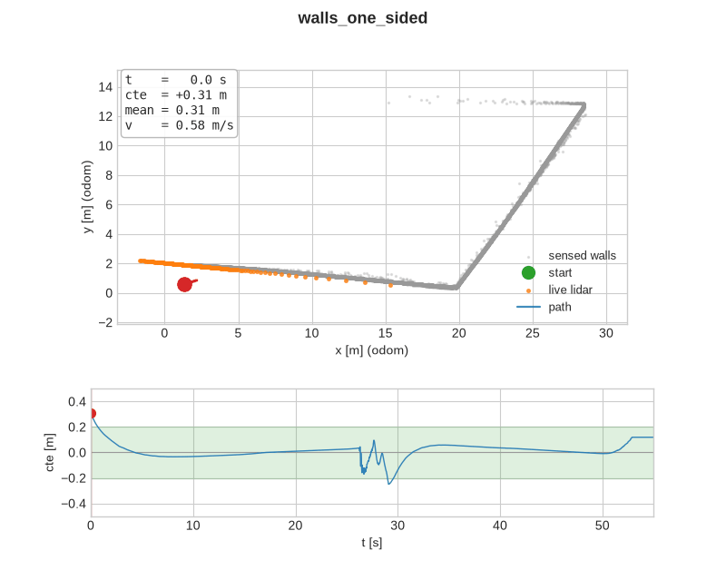

```bash
# render one recorded run (uses docker/output/<name>_traj.csv etc.)
uv run --extra video worldgen video \
    --traj ../../docker/output/walls_one_sided_traj.csv \
    --cte  ../../docker/output/walls_one_sided.csv \
    --scan ../../docker/output/walls_one_sided_scan.csv \
    --title walls_one_sided --out walls_one_sided.mp4

# or render a clip per world as part of scoring
uv run --extra video worldgen eval --video
```

Everything is drawn in the **odom frame**. Wheel odometry drifts a few degrees
relative to the Gazebo world and there is no world-pose topic in this sim, so
painting the walls from the lidar keeps the robot, its scan, and the walls
mutually consistent instead of registering odom against the static `.world`
geometry.

Rendering is an **optional** feature. It needs `matplotlib` (the `video`
extra) plus `ffmpeg` on PATH for mp4 output; without ffmpeg it falls back to an
animated GIF. The recorder (`docker/record_run.sh`) writes the three CSVs:
`<name>_traj.csv` (`t,x,y,yaw`), `<name>.csv` (`t,cte`), and `<name>_scan.csv`
(`t,angle_min,angle_increment,ranges...`).

> Use `uv run --extra video`, not `--with matplotlib`: the installed
> `worldgen` entry point pins the project venv and ignores `--with` overlays.

## Showcase: three followers on the generated suite

This is the whole point of worldgen: take a follower, throw a battery of
generated courses at it, score every run, and watch where it breaks. Here are
three versions of the same PID follower, recorded headless on five generated
worlds and scored by the harness:

* **original** (`wall_follower_og.py`) — the handout's two-beam solution.
* **improved** (`wall_follower.py`) — line-fit wall estimate, PID on curvature,
  inside-corner anticipation, a reacquire state for wall-loss.
* **robust** (`robust_wall_follower.py`) — the improved follower with a
  corner-hardened reacquire (see the diagnosis below).

| world | what it stresses | original | improved | robust |
|-------|------------------|----------|----------|--------|
| `gen_zigzag`     | zigzag, ±60° corners         | WARN · 0.40&nbsp;m · 100% | **PASS · 0.13&nbsp;m · 100%** | **PASS · 0.12&nbsp;m · 100%** |
| `gen_gaps`       | doorway gaps (wall-loss)     | FAIL · 2.88&nbsp;m · 29%  | **PASS · 0.16&nbsp;m · 100%** | **PASS · 0.19&nbsp;m · 100%** |
| `gen_curve_left` | constant 135° left arc       | FAIL · 0.69&nbsp;m · 100% | **PASS · 0.11&nbsp;m · 100%** | **PASS · 0.10&nbsp;m · 100%** |
| `gen_s_curve`    | gentle S-curve               | PASS · 0.11&nbsp;m · 100% | PASS · 0.11&nbsp;m · 100% | PASS · 0.11&nbsp;m · 100% |
| `gen_gauntlet`   | mixed inside+outside corners | WARN · 0.18&nbsp;m · 66%  | FAIL · 2.27&nbsp;m · 52%  | **WARN · 0.32&nbsp;m · 74%** |

Each cell is `verdict · mean |cte| · completion`. `mean |cte|` is over the
on-course portion; verdicts are the harness's (`PASS` > 90% complete and mean
|cte| < 0.3 m, `FAIL` if stalled / < 60% / > 0.5 m, else `WARN`).

The improved follower wins clearly on the corners and the doorway gaps, where
the original either overshoots the bend or loses the wall at the opening and
never reacquires. But on `gen_gauntlet` the improved follower **regresses**:
it tracks tightly until a sharp outside corner, loses the wall, and drives off
into open space (mean |cte| blows up to 2.3 m, confirmed on a re-run). That is
the harness doing its job, finding a real failure mode instead of a tidy win.

### Why the gauntlet breaks the improved follower, and the robust fix

At a 90° **outside** corner the left wall vanishes for a stretch. The improved
follower's `REACQUIRE` state is a blind, open-loop fixed-radius left arc
(`reacquire_curvature = 0.35` → radius ≈ 2.9 m), with a "spiral guard" that,
after ~200° of commanded turn, gives up and **drives straight**. On the
gauntlet the next wall is only ~2 m away, so the 2.9 m arc swings wide, never
pulls the wall back into the fit sector, and the straight-drive then carries the
robot off into open space. It survives `gen_curve_left` only because there the
wall never actually disappears.

`robust_wall_follower.py` keeps the improved follower's `TRACK`, `BLOCKED` and
wall-estimation logic byte-for-byte (so the worlds it already passes keep
passing) and changes **only** the reacquire behaviour:

* it never drives straight — the wall is always on the left, so a lost wall is
  always rounded by turning left, and the robot can no longer wander off;
* the arc radius is **adaptive**: it tightens as the nearest left return closes
  (hugging a sharp outside corner) and relaxes to the original gentle arc when
  the wall is mid/far (bridging a doorway gap);
* it keeps its forward speed through the turn so the corner arc actually
  progresses instead of collapsing into an in-place loop.

Result: no regressions on the four worlds the improved follower passes, and on
the gauntlet it goes from a catastrophic FAIL (52%, 2.3 m) to the best run of
the three (WARN, 74%, 0.32 m) with no wander. The gauntlet's tight alternating
corners still keep it short of a full PASS — an honest remaining edge.

### gen_gauntlet — mixed inside + outside corners (the differentiator)

<table><tr>
<td align="center"><b>original</b><br>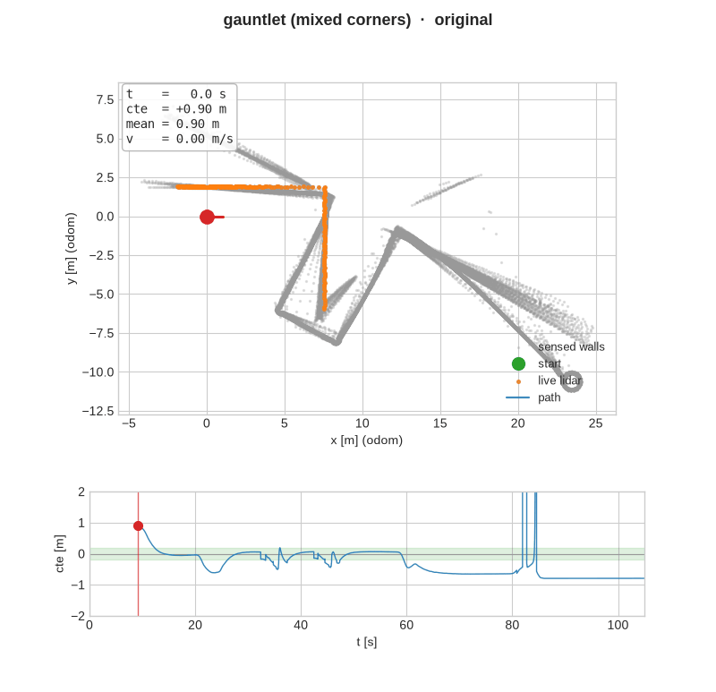</td>
<td align="center"><b>improved (drives off)</b><br>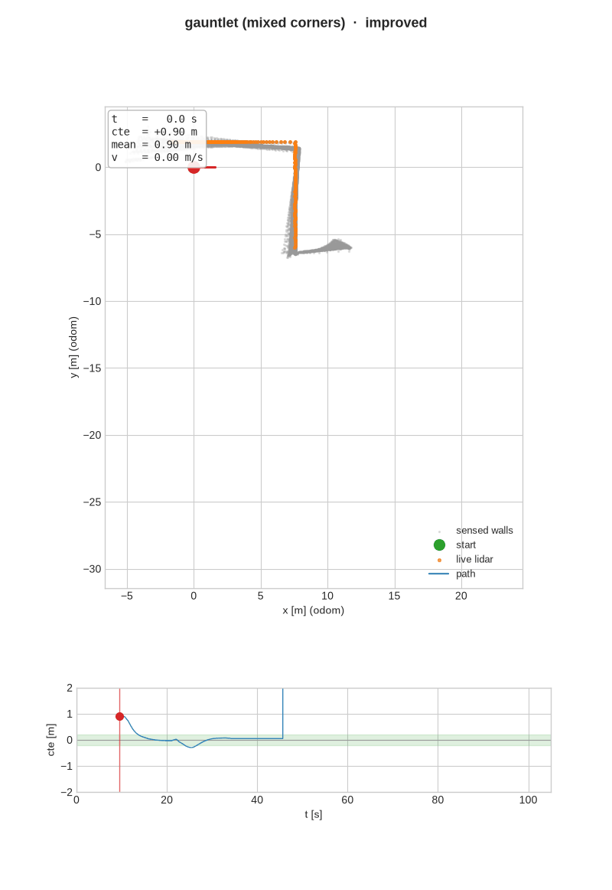</td>
<td align="center"><b>robust</b><br>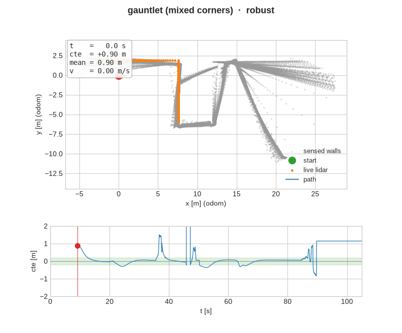</td>
</tr></table>

### gen_zigzag — zigzag, ±60° corners

<table><tr>
<td align="center"><b>original</b><br>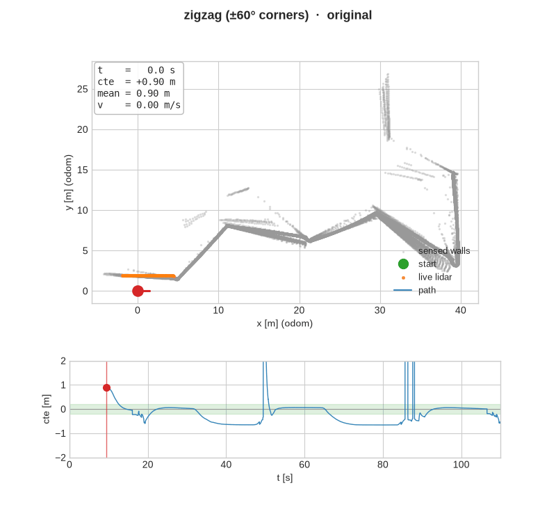</td>
<td align="center"><b>improved</b><br>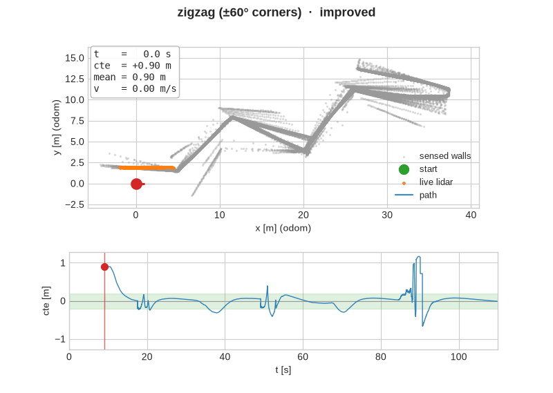</td>
<td align="center"><b>robust</b><br>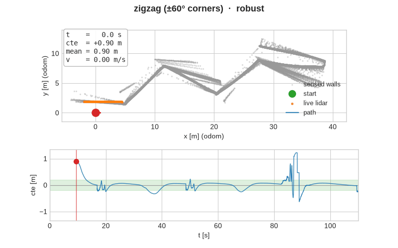</td>
</tr></table>

### gen_gaps — doorway gaps, wall-loss and reacquire

<table><tr>
<td align="center"><b>original</b><br>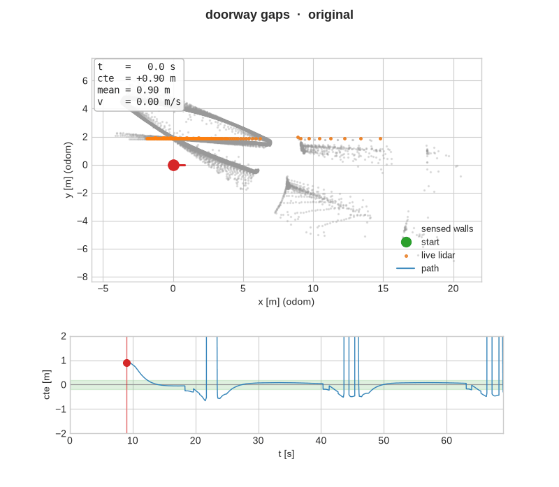</td>
<td align="center"><b>improved</b><br>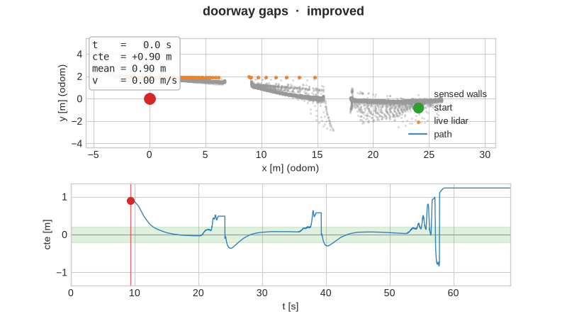</td>
<td align="center"><b>robust</b><br>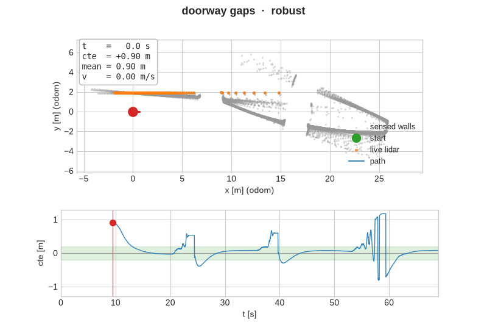</td>
</tr></table>

### gen_curve_left — constant-radius 135° left arc

<table><tr>
<td align="center"><b>original</b><br>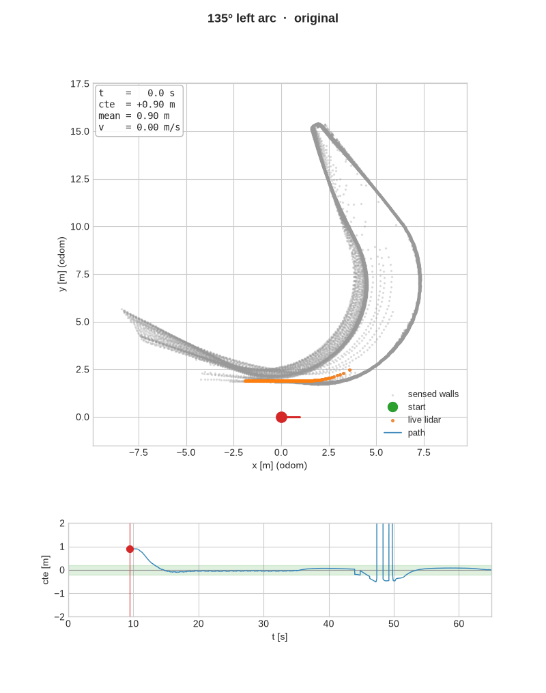</td>
<td align="center"><b>improved</b><br>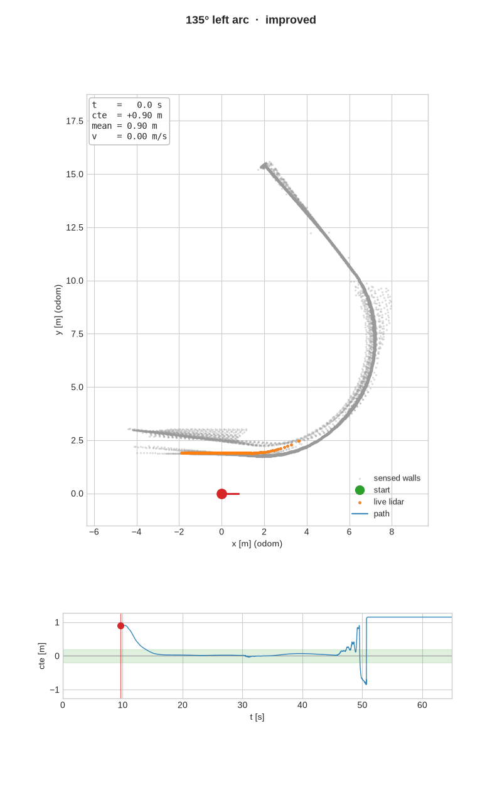</td>
<td align="center"><b>robust</b><br>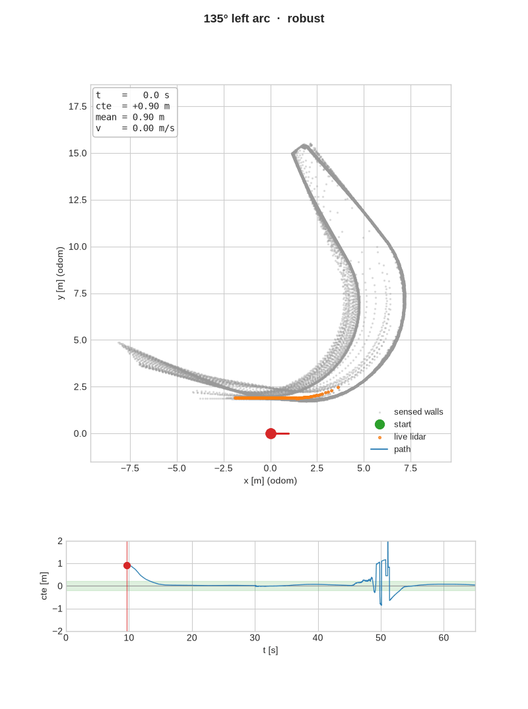</td>
</tr></table>

### gen_s_curve — gentle S-curve

<table><tr>
<td align="center"><b>original</b><br>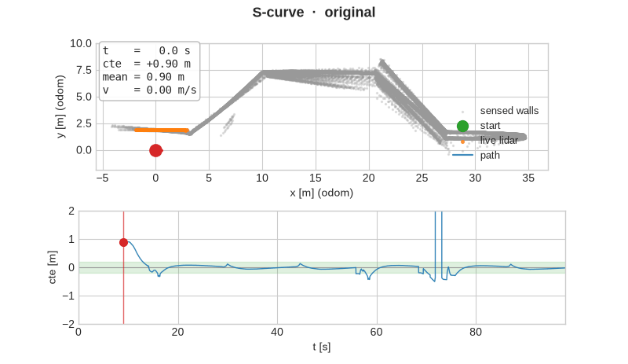</td>
<td align="center"><b>improved</b><br>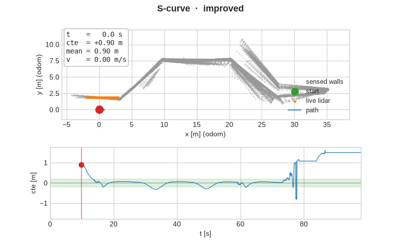</td>
<td align="center"><b>robust</b><br>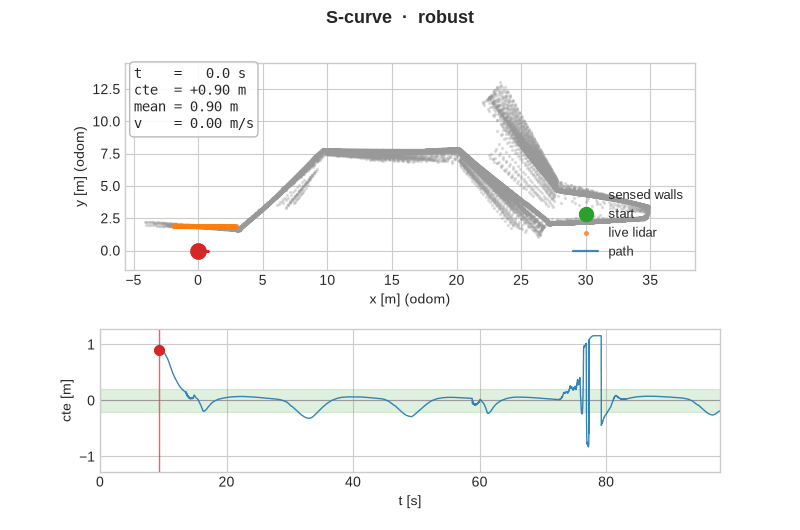</td>
</tr></table>

To reproduce: record a follower on a world with `docker/run.sh record <world>
<secs>` (improved), `record-og` (original) or `record-robust` (robust), then
render each with `worldgen video` and score with `worldgen eval`.

## Using a single world interactively

`docker/run.sh` accepts any world name and copies host-generated worlds into
the running container (no image rebuild):

```bash
cd ../../docker
./run.sh solution gen_zigzag     # Gazebo GUI + Husky + PID follower + rqt
./run.sh viz gen_zigzag          # headless Gazebo + RViz instead of gzclient
./run.sh record gen_zigzag 90    # headless run, saves cte + traj CSV + bag
```

In a plain ROS 2 workspace (no Docker), rebuild so the installed share picks
up the new world:

```bash
colcon build --packages-select wall_following_assigment
ros2 launch wall_following_assigment solution.launch.py world:=gen_zigzag.world
```

## Tests

```bash
uv run --group dev pytest -q
```

`tests/test_geometry.py` covers offsets, bevel fallback, gaps, mirror, and
validation; `tests/test_evaluate.py` covers the scoring math against synthetic
clean / oscillating / stalled recordings.
